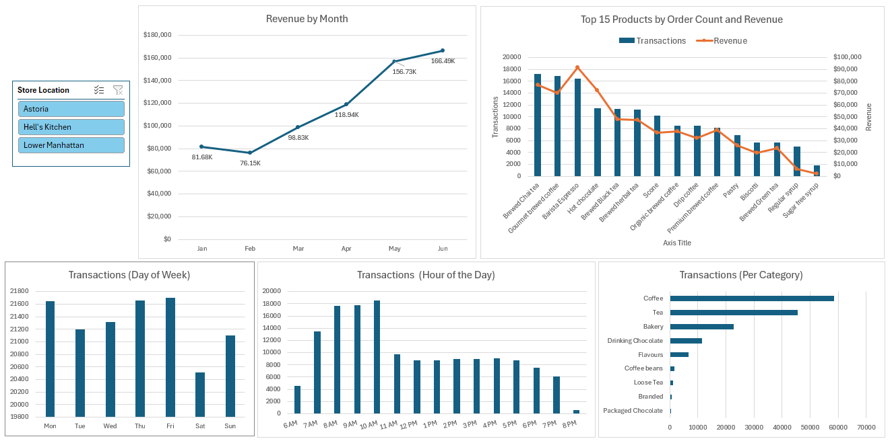

# Coffee Shop Sales Dashboard

An interactive Excel dashboard analyzing coffee shop sales trends across time, products, categories, and store locations.

## Dashboard

  

## Overview

The goal of this project was to analyze coffee shop transaction data and build an interactive Excel dashboard that helps identify sales trends and product performance.

I used Power Query to prepare and transform the raw transaction data, including creating calculated date and time fields and revenue. I then used PivotTables and PivotCharts to analyze revenue trends by month, transaction patterns by day and hour, and product and category performance.

The final dashboard brings these analyses together with an interactive store-location slicer, allowing users to explore sales performance across different locations.

## Key Insights

- June generated the highest monthly revenue at approximately $166.5K, while February recorded the lowest at approximately $76.1K.
- Friday had the highest transaction volume, while Saturday had the lowest.
- Transaction volume was concentrated in the morning, with 8 AM–10 AM representing the busiest hours.
- Coffee was the highest-volume product category, followed by tea and bakery products.
- Brewed Chai Tea had the highest transaction volume among individual products, while Barista Espresso generated the highest revenue.

## Tools & Skills

- Microsoft Excel
- Power Query
- PivotTables
- PivotCharts
- Slicers
- Data Transformation
- Data Analysis
- Dashboard Development

## Dataset

The dataset contains coffee shop transaction records including:

- Transaction ID
- Transaction date
- Transaction time
- Store location
- Product category
- Product type
- Product detail
- Quantity
- Unit price

## Project Workflow

1. **Data Preparation** — Used Power Query to inspect and transform the raw transaction data.
2. **Feature Creation** — Added revenue, month, day of week, and hour fields for analysis.
3. **Data Analysis** — Created PivotTables to analyze revenue and transaction patterns.
4. **Visualization** — Built PivotCharts to visualize the major sales trends.
5. **Dashboard Development** — Combined the charts into an interactive dashboard and added a store-location slicer.

## Files

- `Coffee_Shop_Sales_Dashboard.xlsx` — Excel workbook containing the dashboard, PivotTables, and supporting analysis.
- `dashboard/coffee-shop-sales-dashboard.png` — Preview of the final dashboard.

## Project Context

Completed as a guided project from Maven Analytics to practice data preparation, analysis, and dashboard development using Microsoft Excel.
